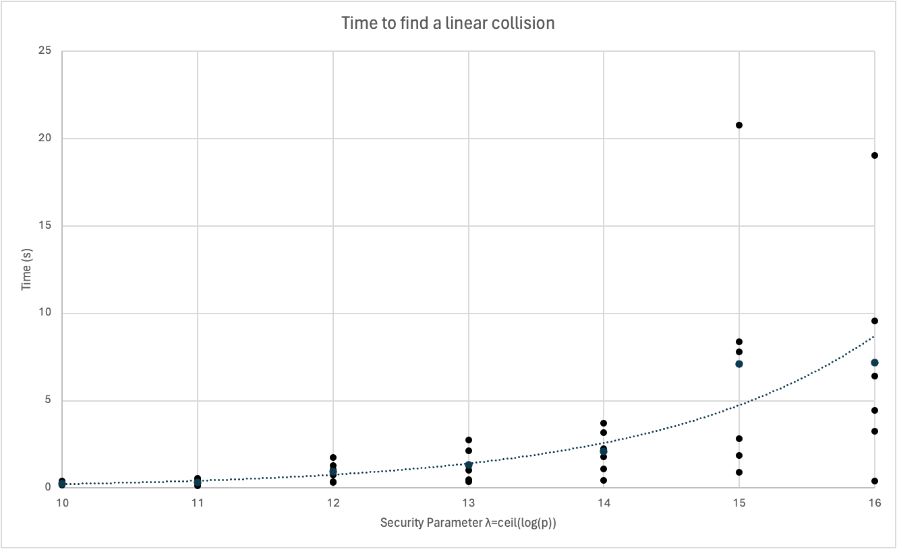
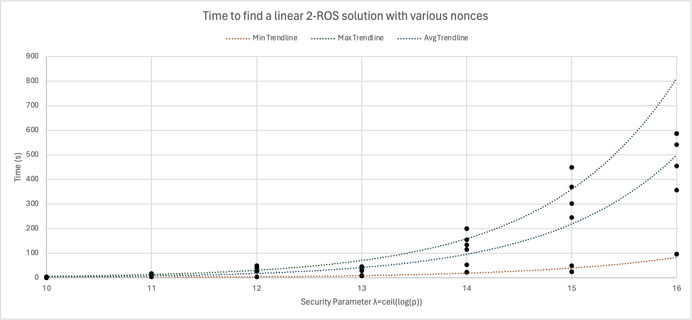
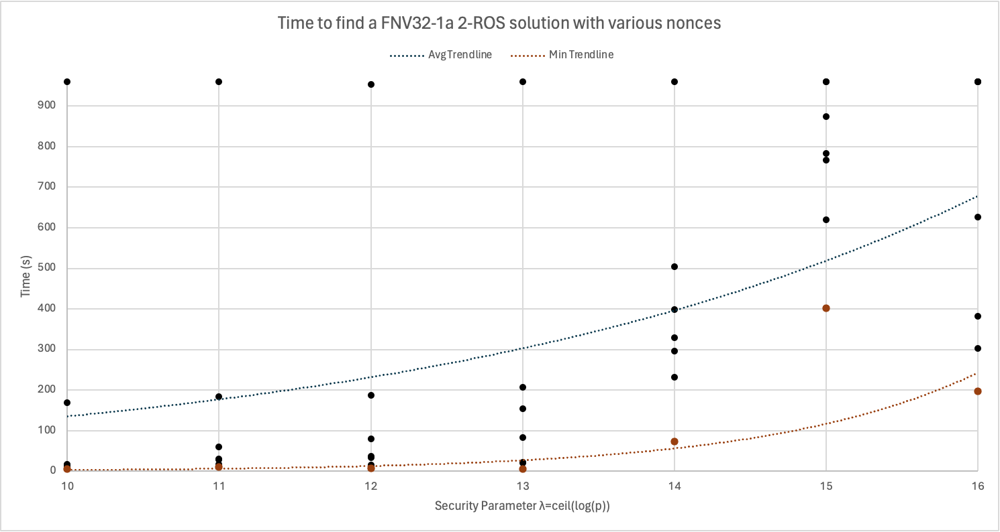

+++
title = 'How Easy is ROS with Not-So-Random Oracles?'
date = 2024-07-10T11:04:08-07:00
draft = false
+++

*This was a mini project for CS 517 (Theory of Computation) at Oregon State University in Spring 2024. We had to use a SAT/SMT solver for some problem related to our research area.*

A Blind Signature Scheme (BSS) is a cryptographic primitive which allows a *user* to obtain a *digital signature* on a message from a *signer* without revealing their message \[Cha82\]. In 1992, Chaum and Pedersen introduced the Schnorr Blind Signature Scheme (SBSS) as the first BSS based on prime-order groups rather than factoring \[CP92\]. The first formal security analysis of the scheme was in 2001 by Schnorr himself \[Sch01\]. Schnorr introduced the _**R**andom Inhomogeneities in an **O**verdetermined **S**olvable System of $\eta+1$ Linear Equations_ ($\eta$-ROS) problem and effectively proved that, in the Random Oracle Model (ROM) + Generic Group Model, the SBSS is secure if and only if ROS is hard \[Sch01\]. If $p > 2^{\lambda-1}$ is a prime and $H : \mathbb{Z}_p^\eta \to \mathbb{Z}_p$ is a random oracle, then the $\eta$-ROS problem is to find distinct vectors $\vec{\rho}_1, \ldots, \vec{\rho}\_{\eta+1} \in \mathbb{Z}_p^{\eta}$ and $\vec{c} \in \mathbb{Z}_p^{\eta}$ such that $$\vec{\rho}_i \cdot \vec{c} = H(\vec{\rho}_i) \text{ for all } i \in [\eta+1].$$ Schnorr called the assumption that $\eta$-ROS is hard for $\eta=O(\mathsf{poly}(\lambda))$ a “plausible but novel complexity assumption,” and proved that it is statistically hard for $\eta=O(\mathsf{polylog}(\lambda))$. Until recently, the fastest algorithm for the problem was to take advantage of Wagner’s sub-exponential time algorithm for the k-list birthday problem \[Wag02\]. However, in 2022, Benhamouda et al. discovered an astonishingly simple polynomial-time algorithm for $\eta$-ROS which works when $\eta \geq \lambda$ \[BLL+22\]. This made the Schnorr BSS impractical for most applications, although it is still secure if the number of concurrently open signing sessions is limited to $1$ or $2$ \[KLX22; HX24\], essentially because $\eta$-ROS is hard for $\eta\in\{1,2\}$. This motivates our interest in 2-ROS.

As Schnorr's security analysis of the SBSS is in the ROM, it is, strictly speaking, not a proof of security for real-world implementations of the scheme which substitute the random oracle for a strong cryptographic hash functions like SHA512. The folklore assumption is that a cryptographic hash function is "close enough" to a random oracle. This is a widely accepted heuristic as there are only contrived examples of cryptographic schemes which have ROM security proofs but are broken in practice. There is no existing proof that $O(\mathsf{polylog}(\lambda))$-ROS is hard in the standard model, i.e., when $H$ is a cryptographic hash function rather than a random oracle. In particular, it is not clear whether we can rule out the existence of a cryptographic hash function for which $O(\mathsf{polylog}(\lambda))$-ROS (with respect to that hash function) is easy, or even vice versa.

In this project, we aim to study the concrete hardness of 2-ROS for some non-cryptographic hash functions. Specifically, our goal is to solve small instances of 2-ROS with regard to two families of non-cryptographic hash functions:
* Affine, i.e., $\mathsf{H}(q_1,q_2) = (\lambda_0 + \lambda_1 q_1 + \lambda_2 q_2) \bmod{p}$ ; and,
* Fowler-Noll-Vo-1a (FNV-1a): a widely used non-cryptographic hash function that is fast and easy to implement \[FNV+24].

Our approach was to translate these non-cryptographic hash functions into SMT formulas and then use the Z3 Theorem Prover to search for a 2-ROS solution. Our hypothesis was that for these relatively simple non-cryptographic hash function, an SMT solver will be able to find 2-ROS solutions much faster than a brute-force approach.

After designing a tool which uses Z3 to find 2-ROS solutions with respect to affine hash functions and the FNV32-1a hash function for a fixed prime and hash salt, we benchmarked our tool for $p$ a $\lambda$-bit prime where $\lambda \in \{10,11,12,13,14,15,16\}$ and various random salts. Much larger values of $\lambda$, such as $\lambda=256$, are used in practice. Our tool is not able to solve 2-ROS instances with parameters even close to large enough to be relevant for real-world cryptography, even for the simplistic non-cryptographic hash functions we studied. However, our tool yields a considerable speed-up when compared to a brute-force approach. We were able to solve some 2-ROS instances for $\lambda=16$ in a matter of minutes with regard to both affine and FNV32-1a hash functions, whereas a brute-force C program failed to find a solution in a few hours even for $\lambda=10$. These results illustrate the power of modern SMT solvers and the dangers of using non-cryptographic hash functions.
## Preliminaries
Let $\lambda$ be the security parameter. Let $2^{\lambda-1} < p < 2^{\lambda}$ be a prime. We write SMT formulas in SMT-LIBv2 format. We write $\mathsf{bin}^{-1}(s)$ to denote the unsigned integer corresponding to the binary string $s$. We use the prefix $\text{0x}$ to denote a binary bit string written in hexadecimal, e.g. $\text{0xDEADBEEF}$ corresponds to the 32 bit binary string corresponding to the unsigned integer $(\text{deadbeef})_{16}=3735928559$.
### Hash Functions
In this paper we consider keyed hash functions with domain $\mathbb{Z}_p^2$ and codomain $\mathbb{Z}_p$. That is, a hash function is an function $H: \{0,1\}^{\ell(\lambda)} \times \mathbb{Z}_p^2 \to \mathbb{Z}_p$ where $\ell : \mathbb{N} \to \mathbb{N}$ is a function which maps the security parameter to a key length. We use the notation $H^s(a,b) := H(s,a,b)$. Usually a hash function is considered "good" if it is cheap to evaluate and hashes are close to uniformly distributed. A _cryptographic_ hash function is typically expected to satisfy at least three security properties, which we now formally define. In each of the following experiments, the challenger first samples $s$ uniformly at random from $\{0,1\}^{\ell(\lambda)}$ and then shares $s$ with the adversary. A hash function $H$ is called:
- *preimage-resistant* if given $z \in \mathbb{Z}_p$ it is hard to find $(x,y) \in \mathbb{Z}_p^2$ such that $H^s(x,y) = z$;
- *second-preimage resistant* if given $(x,y) \in \mathbb{Z}_p^2$ it is hard to find $(x',y') \in \mathbb{Z}_p^2$ such that $(x',y') \neq (x,y)$ and $H^s(x,y) = H^s(x',y')$; and,
- *collision-resistant* if it is hard to find $(x,y),(x',y') \in \mathbb{Z}_p^2$ such that $(x',y') \neq (x,y)$ and  $H^s(x,y) = H^s(x',y')$.
We note that for compressive hash functions (as we consider in this paper), collision-resistance implies second-preimage resistance, which in turn implies preimage-resistance.

With this terminology, we could define an analogous property for $\eta$-ROS. Formally, we might say that a hash function is _$\eta$-ROS resistant_ if it is hard to find distinct $\vec{\rho}_1,\vec{\rho}_2,\vec{\rho}_3 \in \mathbb{Z}_p^2$ and $\vec{c} \in \mathbb{Z}_p^2$ such that $\vec{\rho}_i \cdot \vec{c} = H^s(\vec{\rho}_i)$ for all $i \in \{1,2,3\}$.
## Reduction to SMT
As we'll need to perform XORs for the FNV32 hash function and Z3 is much slower when it has to convert back and forth between bit vectors and integers, we use bit vectors universally in this project. For our experiments, we set $\lambda \leq 16$. Consequentially, we work with bit vectors of length 32 so that the product of any two integers modulo p does not overflow. 
### Affine hash functions
For an affine hash function, we use the key to determine the coefficients. That is, we set $\ell(\lambda) = 3\lceil \log p \rceil$, and $H: \{0,1\}^{\ell(\lambda)} \times \mathbb{Z}_p^2 \to \mathbb{Z}_p$ is defined to be
$$H^s(q_1, q_2) = \lambda_0 + \lambda_1 q_1 + \lambda_2 q_2,$$
where if $s_1, s_2, s_3 \in \{0,1\}^{\lceil \log p \rceil}$ are such that $s = s_1 \| s_2 \| s_3$ then $$\lambda_0=\mathsf{bin}^{-1}(s_1), \lambda_1=\mathsf{bin}^{-1}(s_2), \lambda_2=\mathsf{bin}^{-1}(s_3).$$Writing this function as an SMT formula is not too hard, though there are some subtleties when it comes to optimization. For example, we do the entire computation in 64 bits and then take the result modulo p just once at the very end. It would suffice instead to work in 32 bits and just take the result modulo $p$ at every step of the computation, and while this might seem reasonable, it turns out to be significantly slower. In general, the name of the game when optimizing SMT-LIB bit vector formulas is to avoid bvmul, bvurem, and bvxor as much as possible. Our final implementation is shown below.

```smtlib
(declare-const salt (_ BitVec 48))
; salt_constraint

(declare-const l0 (_ BitVec 64))
(assert (= l0 (bvurem ((_ zero_extend 48) ((_ extract 47 32) salt)) ((_ zero_extend 32) p))))

(declare-const l1 (_ BitVec 64))
(assert (= l1 (bvurem ((_ zero_extend 48) ((_ extract 31 16) salt)) ((_ zero_extend 32) p))))

(declare-const l2 (_ BitVec 64))
(assert (= l2 (bvurem ((_ zero_extend 48) ((_ extract 15 0) salt)) ((_ zero_extend 32) p))))

(declare-fun H ((_ BitVec 32) (_ BitVec 32)) (_ BitVec 32))

(assert (forall ((a (_ BitVec 32)) (b (_ BitVec 32))) (= (H a b)
	((_ extract 31 0) (bvurem
		(bvadd
			l0
			(bvmul ((_ zero_extend 32) a) l1)
			(bvmul ((_ zero_extend 32) b) l2))
		((_ zero_extend 32) p))))))
```
This formula is relatively simple:
- We first define the constants `l0`, `l1` and `l2` which correspond to $\lambda_0$, $\lambda_1$, and $\lambda_2$.
- Then we set the hash function output on bit vectors `a` and `b` to be the sum of `l0`, the multiplication of `a` with `l1`, and the multiplication of `b` with `l2`. We take the result modulo `p` at the end.

As a sort of test/benchmark, we can find a collision by telling Z3 to search for $x,y,u,v \in \mathbb{Z}_p$ such that $(x,y) \neq (u,v)$ and $H(x,y) = H(u,v)$. With $p=65497$ and coefficients $\lambda_0 = 33505$, $\lambda_1=17111$ and $\lambda_2 = 59507$, Z3 finds $\mathsf{H}(23805, 1568) = \mathsf{H}(1, 838) = 8768$ in about 7 seconds. Finding a collision for a affine hash function of this form is quite easy:
1. Pick some random $u,v \in \mathbb{Z}_p$ , say $1$ and $838$.
2. Compute $\mathsf{H}(u,v)$
3. Pick a number $x \in \mathbb{Z}_p$ which is not $1$, say $23805$.
4. Compute $y = (\mathsf{H}(u,v) - \lambda_0 - x \lambda_1) \lambda_2^{-1}$, in this case 1568.



Finding a 2-ROS solution for a affine hash function is also easy. Consider that
$$
\begin{pmatrix} 1 & 0 \\ 0 & 1 \\ 2 & -1 \end{pmatrix} \cdot \begin{pmatrix} H(1, 0) \\ H(0, 1) \end{pmatrix} = \begin{pmatrix} H(1, 0) \\ H(0, 1) \\ 2H(1,0) - H(0,1) \end{pmatrix} = \begin{pmatrix} H(1, 0) \\ H(0, 1) \\ \lambda_0 + 2\lambda_1 - \lambda_2 \end{pmatrix} = \begin{pmatrix} H(1, 0) \\ H(0, 1) \\ H(2,-1) \end{pmatrix}.
$$
### FNV-1a
The 32-bit variant of FNV-1a uses the constants $\mathrm{offset\_basis} = \text{0x811C9DC5}$ and $\mathrm{FNV\_prime} = \text{0x01000193}$. The pseudocode for the hash function, taken from \[FNV+24\], is extremely simple:
```
hash = offset_basis
for each octet_of_data to be hashed
	hash = hash xor octet_of_data
	hash = hash * FNV_Prime
return hash
```
For our implementation, we define $$H^s(a,b) = \text{FNV32}(s \| \mathsf{bin}(a) \| \mathsf{bin}(b)) \pmod{p}.$$As a functional SMT-LIB formula:
```smtlib
(declare-const salt (_ BitVec 48)) ; only the LSB is used
; salt constraint

(declare-const fnvp (_ BitVec 32))
(assert (= fnvp #x01000193))

(declare-const fnvo (_ BitVec 32))
(assert (= fnvo #x811c9dc5))

(declare-fun fnvstep ((_ BitVec 32) (_ BitVec 8)) (_ BitVec 32))

(assert (forall ((a (_ BitVec 32)) (b (_ BitVec 8))) (= (fnvstep a b) (bvmul (bvxor a ((_ zero_extend 24) b)) fnvp))))

(declare-fun H ((_ BitVec 32) (_ BitVec 32)) (_ BitVec 32))

(declare-const fnvon (_ BitVec 32))
(assert (= fnvon (fnvstep fnvo ((_ extract 7 0) salt))))

(assert (forall ((a (_ BitVec 32)) (b (_ BitVec 32))) (= (H a b)
    (bvurem
	    (fnvstep
	        (fnvstep
	             (fnvstep
	                (fnvstep fnvon ((_ extract 7 0) a))
					((_ extract 15 8) a))
				((_ extract 7 0) b))
	      ((_ extract 15 8) b))
      p))))
```

Breaking this formula down, we essentially:
1. Initialize the `salt` variable as bit vector of size 48. We will only use the first byte for $s$, this is just an artifact of the fact that the affine salt is 6 bytes, and it is nice to keep the length consistent.
2. Initialize and set the `fnvp` (FNV prime) and `fnvo` (FNV offset) constants.
3. Design an `fnvstep` function which corresponds to an iteration of the FNV32-1a for loop shown in the pseudocode.
4. Set `fnvon` to be the `fnvstep` function applied to the FNV offset (which we do on the first iteration of the pseudocode for loop) with the salt `s`
5. Design an $H$ function which nests `fnvstep` starting with `fnvon` and the first byte of $a$, then that result with the second byte of $a$, and so on.

For five randomly chosen salts, Z3 was unable to find an FNV32-1a collision in a reasonable amount of time (~15 minutes on a Macbook M1) even for $\lambda=10$. While 2-ROS is almost certainly easy for FNV32-1a due to the non-cryptographic properties of the hash function (sticky state, diffusion, work factor), the algorithm is not as trivial as for an affine hash function. Still, the fact that Z3 is so much slower for FNV32-1a than affine is reason to believe that FNV32-1a is "more cryptographic" than affine, as we would expect.
### 2-ROS
Recall that a $2$-ROS solutions satisfies the following matrix equation $$
	\begin{pmatrix}
		\rho_{1,1} & \rho_{1,2} \\
		\rho_{2,1} & \rho_{2,2} \\
		\rho_{3,1} & \rho_{3,2}
		\end{pmatrix} \begin{pmatrix}
		c_1 \\
	c_2 \end{pmatrix} =
	\begin{pmatrix}
		\mathsf{H}(\rho_{1,1}, \rho_{1,2}) \\
		\mathsf{H}(\rho_{2,1}, \rho_{2,2}) \\
		\mathsf{H}(\rho_{3,1}, \rho_{3,2})
	\end{pmatrix}.$$We introduce variables corresponding to the variables on the left-hand side and assertions to find solutions of this form.
```smtlib
(declare-const rho11 (_ BitVec 32))
(assert (bvult rho11 p))
; ... rho12, rho21, rho22, rho31, rho32, c1, c2 are (_ BitVec 32) and < p

(assert (= 
	((_ extract 31 0) (bvurem
		(bvadd
			((_ zero_extend 32) (bvmul c1 rho11))
			((_ zero_extend 32) (bvmul c2 rho12)))
		((_ zero_extend 32) p))) 
	(H rho11 rho12)))
; same as above but for rho21 and rho22
; same as above but for rho31 and rho32
```
## Results

We measured the time to find affine 2-ROS solutions for $p \in \{1013, 2027, 4097, 8219, 16363, 32717, 65521\}$ and random keys $s$. Only one choice of $p$ ($65521$) and $s$ did not yield a solution in less than 960 seconds, and we excluded this point from the plot.



The data for FNV32-1a 2-ROS is less clear because even for small parameters like $\lambda=10$, finding a 2-ROS solution with some $s$-values took more than 960 seconds. Any points in the plot below situated at the top correspond to instances which were not solved in less than 960 seconds. We treat those values as 960 when computing the average trendline. In reality the average could be much higher, but we note that only slightly less than half of the instances are solvable in time less than the average trendline. It is not clear why some salts make a given FNV32-1a 2-ROS problem much harder even for a fixed prime.



Interestingly, the data show that while finding a 2-ROS solution takes longer than finding a collision for affine hash functions, the opposite is true for FNV32-1a. That is, while Z3 was unable to find any FNV32-1a collisions in a reasonable amount of time for randomly chosen salts, it was able to find many FNV32-1a 2-ROS solutions.

For comparison, we implemented a C program to perform a brute-force random search for an FNV32-1a 2-ROS solution. For five randomly chosen salts and $\lambda=16$, the brute-force program failed to find a solution in less than 2 hours. For the same parameters, Z3 was able to _find a solution_ for 4/5 of the randomly chosen salts in under 15 minutes. This is a significant improvement, but as the plot shows, even with our approach the time to find a solution grows exponentially with the security parameter. If we extrapolate from our data to $\lambda = 80$, we can estimate that even the easiest instances would take roughly 30,000 times the age of the universe. That also assumes unbounded memory and no considerable slow-down from working with larger bit vectors.

We also implemented the FNV64 hash function in Z3 and managed to find a 2-ROS solution for $p=65537$, although this took 144 minutes on a Macbook M1. Z3 failed to find a 2-ROS solution for any primes close to $2^{17}$ in a reasonable amount of time (less than an hour).
## The Tool
We created an easy to use tool for solving affine or FNV32-1a 2-ROS for an arbitrary prime and salt. It is available on [GitHub](https://github.com/fharding1/smt-ros/). Usage is fairly simple, for example, the command
```
./solve.sh affine 1013 '#x123456789123'
```
produces an output with values for `rho11,rho12,rho21,rho22,rho31,rho33` and `c1 c2` which satisfy the 2-ROS matrix equation mentioned in the previous section. The tool also outputs the time and memory which was used.

It also includes a script for running the benchmarks which were used to create the plots in this project. By default, the values chosen for benchmarking were $$p \in \{1013, 2027, 4079, 8219, 16363, 32717, 65521\}$$ and $$s \in \{\text{\#x73b0827dc98c}, \text{\#x8f6beed01b56}, \text{\#x9ad742038d67}, \text{\#x295f7ddd2dd7},\\ \text{\#xfe8113a9ba0c}, \text{\#xc0d795c6ab93}\}.$$
Simply run `./benchmark.sh affine` or `./benchmark.sh fnv32` to get an output where the i-th line is a comma-separated list of times to compute a 2-ROS solution for the i-th prime and various nonces. 
## Future work
It is likely possible to speed up our approach on hard instances by parallelizing and introducing random constraints on the solution. For example, consider the FNV32-1a 2-ROS instance with $p=1013$ and $\mathsf{salt}=\text{0x73b0827dc98c}$ which takes more than 960 seconds to solve with no constraints. If we force the least significant nibble of $\rho_{1,2}$ to be $\text{0x1}$, then this instance is solvable in roughly 8 seconds. However, this change makes other instances which were previously quickly solvable now take more than 960 seconds.

It would also be interesting to describe an efficient algorithm for finding a 2-ROS solution for the FNV32-1a hash function, which should be possible since it is non-cryptographic.
### References
\[Cha82\]: David Chaum. “Blind Signatures for Untraceable Payments”. In: CRYPTO. 1982, pp. 199–203.

\[CP92\]: David Chaum and Torben P. Pedersen. “Wallet Databases with Observers”. In: CRYPTO. 1992, pp. 89–105.

\[FNV+24\]: Glenn Fowler, Landon Curt Noll, Kiem-Phong Vo, Donald E. Eastlake 3rd, and Tony Hansen. The FNV Non-Cryptographic Hash Algorithm. Internet-Draft draft-eastlake-fnv-22. Work in Progress. Internet Engineering Task Force, Apr. 2024. 112 pp. url: https://datatracker. ietf.org/doc/draft-eastlake-fnv/22/.

\[HX24\]: Franklin Harding and Jiayu Xu. "Unforgeability of Blind Schnorr in the Limited Concurrency Setting". URL: https://eprint.iacr.org/2024/1100.pdf.

\[KLX22\]: Julia Kastner, Julian Loss, and Jiayu Xu. "On Pairing-Free Blind Signature Schemes in the Algebraic Group Model". In: PKC. 2022.

\[RS04\]: Phillip Rogaway and Thomas Shrimpton. “Cryptographic Hash-Function Basics: Definitions, Implications, and Separations for Preimage Resistance, Second-Preimage Resistance, and Collision Resistance”. In: Fast Software Encryption (2004), pp. 371–388.

\[Sch01\]: Claus Peter Schnorr. “Security of Blind Discrete Log Signatures against Interactive Attacks”. In: Information and Communications Security. 2001, pp. 1–12.

\[Wag02\]: David Wagner. “A Generalized Birthday Problem”. In: CRYPTO. 2002, pp. 288–303.
